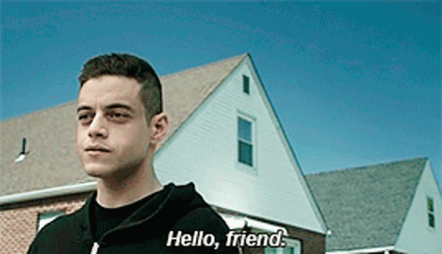

## Hey 👋, I'm [Siddharth](https://github.com/sidsbrmnn)

I'm Siddharth Subramanian, a _full-stack developer_ currently pursuing BE in Information Science and Engineering. I'd love to sit down and have a conversation on improving the user experience or even on a badass design (especially with coffee). It'd be a **crime** to say that I don't love problem-solving (considering how much I obsess over server-side scripting) but also a lot cliched if I say that I do. I can sit down to watch a test match (trust me, I wake up early morning for it). But no matter what, coding without some EDM is clearly not the right thing to do.

I'm absolutely ok with having errors in my code, but definitely not formatting or linting warnings.

Feel free to reach out if you want to collaborate on something or have an exciting idea. I'd absolutely love to be a part of it.

### What am I upto these days

-   🔭 I'm currently working migrating [Fest Management System](https://github.com/sidsbrmnn/fest-management-system) to Laravel (why? Because I never liked PHP from the very beginning but after trying Laravel, my senses have been dialed up. Oh, and I really need to come up with a better UI for it.)

-   🌱 I'm learning [Golang](https://golang.org) and [Laravel](https://laravel.com)

-   💻 My recent projects: [Bolo Meet](https://bolomeet.com), [Tachyon Motorsport](https://tachyonmotorsport.com)

-   📫 How to reach out to me: [email](mailto:sidsbrmnn@gmail.com) [twitter](https://twitter.com/sidsbrmnn)

### My GitHub Stats

